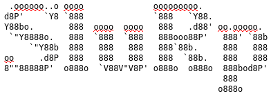

<p align="center">


*Statistical Lisp in R*
</p>

Implemention of Lisp-style sytnax and language design for the `R`
programming language. Code written in SluRp will be translated to `R`
and then executed in that environment.

This project isn't intended as a production ready application or
alternative to `R` but rather a fun project to learn something about
the implementation of lisp and the core `R` language.

## Quick-start Guide

Start the REPL:

```bash
./slurp
SluRp>
```

In the REPL you can enter the lisp-style commands:

```lisp
(+ 2 (* 2 3))

# [1] 8
```

Create variables using the `defparam` function. This function returns
the value associated with the variable name. These variables can then
be references in the same scope.

```lisp
(defparam x 5)

# [1] 5

(defparam y 10)

# [1] 10

(+ x y)

# [1] 15
```

As its implemented in the `R` environment, the usual statistical
functions are readily available. Here we are taken 10 samples from a
normal distribution with the centre and scale of 10. The return of
this function is a vector of 10 elements.

```lisp
(rnorm 10 10 10)

# [1]  14.8692128   3.4932029  18.6337963  15.5319696  -2.9426000 -11.6523209
# [7]  -0.9475137   6.1512033   4.6517305   8.0993424
```

As opposed to `R` base, most functions return a value. Take for
example the `print()` function in `R` that prints the passed argument
to the stream output. In SluRp, the argument that is passed to the
function is printed to the stream and also returned.

```lisp
(print "testing")

# "testing"
# [1] "testing"
```

Lisp is a list processor, but we're working with `R`, so we have
access to more complex data-types. One of which is the vector or `c()`
data-type for simple storage and vector arithmetic. We can create a
vector with squared-brackets, e.g. `[1 2 3]` is translated to `c(1, 2,
3)`. This translation is necessary for when we're using functions that
expect vector arguments:

```lisp
(mean [1 2 3 4 5])

# [1] 3
```

## Things to do:

- [X] Lisp tokenisation
- [X] Basic function application
- [X] Vector notation
- [X] Nested function application
- [ ] Function definitions
- [X] Lambdas
- [X] Variable assignments
- [ ] Sets and Lists
- [ ] Keyword arguments
- [ ] Macros
- [ ] Pre-installed macros such as threading

### Functions to implement

- [ ] Cons
- [ ] Listp
- [ ] Atomp
- [ ] Better evaluation - special symbols evaluate to themselves
- [ ] Better tokenisation -- should take into account the end of the list to allow scripts to run
- [ ] Quote/Eval
