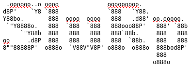

<p align="center">


*Statistical Lisp in R*
</p>

[](https://jaypmorgan.github.io/slurp/index.html)

Implemention of Lisp-style sytnax and language design for the `R`
programming language. Code written in SluRp will be translated to `R`
and then executed in that environment.

This project isn't intended as a production ready application or
alternative to `R` but rather a fun project to learn something about
the implementation of lisp and the core `R` language.

## Quick-start Guide

Start the REPL:

```bash
./slurp
SluRp>
```

Or you can run a SluRp script:

```bash
./slurp test.slurp
```

In the REPL you can enter the lisp-style commands:

```lisp
SluRp> (+ 2 (* 2 3))

# [1] 8
```

Unlike `R`, arithmetic functions are applied over all arguments:

```lisp
SluRp> (+ 1 2 3 4 5)
[1] 15
```

Create variables using the `defparam` function. This function returns
the value associated with the variable name. These variables can then
be references in the same scope.

```lisp
SluRp> (defparam x 5)

# [1] 5

SluRp> (defparam y 10)

# [1] 10

SluRp> (+ x y)

# [1] 15
```

As its implemented in the `R` environment, the usual statistical
functions are readily available. Here we are taking 10 samples from a
normal distribution with the centre and scale of 10. The return of
this function is a vector of 10 elements.

```lisp
SluRp> (rnorm 10 10 10)

# [1]  14.8692128   3.4932029  18.6337963  15.5319696  -2.9426000 -11.6523209
# [7]  -0.9475137   6.1512033   4.6517305   8.0993424
```

Function arguments can be supplied using the `:keyword` form. For example:

```lisp
SluRp> (rnorm 10 :mean 10 :sd 1)
 [1] 10.306800 11.189320 10.914911 10.141386 11.459372  9.440626 10.889350
 [8]  9.807462 11.059608 10.595251
```

In this example, we are once again calling the `rnorm` function and taking 10 samples from a normal distribution. But instead of supplying the arguments by the position they occur in the function call (number of samples, mean, and then standard deviation of the distribution), we are using keywords. When this form is evaluated in `R` this gets translated to:

```R
rnorm(10, mean = 10, sd = 1)
```

As opposed to `R` base, most functions return a value. Take for
example the `print()` function in `R` that prints the passed argument
to the stream output. In SluRp, the argument that is passed to the
function is printed to the stream and also returned.

```lisp
SluRp> (print "testing")
[1] "testing"
[1] "testing"
```

### Data types

Lisp is a list processor, but we're working with `R`, so we have
access to more complex data-types. One of which is the vector or `c()`
data-type for simple storage and vector arithmetic. We can create a
vector with squared-brackets, e.g. `[1 2 3]` is translated to `c(1, 2,
3)`. This translation is necessary for when we're using functions that
expect vector arguments:

```lisp
SluRp> (mean [1 2 3 4 5])
[1] 3
```

### Creating functions

Anonymous functions can be created using a `lambda` expression. Take
for example applying a function to a map (from the `purrr` package).

```lisp
SluRp> (library purrr)

SluRp> (map [1 2 3] (lambda (x) (* x 2)))
[[1]]
[1] 2

[[2]]
[1] 4

[[3]]
[1] 6
```

Anonymous functions can also be bound to a name. This is perhaps just
a longer way of creating a function.

```lisp
SluRp> (defparam print_name (lambda (name) (print (paste "Hello, " name))))
function (name)
{
    print(paste("Hello, ", name))
}
SluRp> (print_name "SluRp")
[1] "Hello,  SluRp"  # value is printed to stream
[1] "Hello,  SluRp"  # value is also returned
```

The shorter way to create a normal function is to use the `defun`
function. The arguments to `defun` are the parameters of the function
(or an optional empty list) and the body of the function i.e. what
happens when the function is called.

```lisp
SluRp> (defun add (x y) (+ x y))
function (x, y)
{
    x + y
}
SluRp> (add 1 2)
[1] 3
```

## Language Lasagnes

What programming stack do you use? Answer: all of them:

```lisp
;; use slurp to talk to R, to talk to python, to talk to c/c++
;; use reticulate to talk to python
(library reticulate)

;; import numpy as torch which should be implemented in C/C++
(defparam np (import "numpy"))
(defparam torch (import "torch"))
(defparam nn (import "torch.nn"))

;; define a simple feedforward network as a test
(defparam model
  (nn$Sequential (nn$Linear :in_features 4L :out_features 10L)
                 (nn$ReLU)
                 (nn$Linear :in_features 10L :out_features 3L)
                 (nn$Softmax)))

;; Use the existing iris dataset from R
;; create a matrix of all the input features
;; convert to a numpy array and then a torch tensor
(defun get-data ()
  (torch$FloatTensor
    (np$array
      (as.matrix (select iris [Sepal.Width, Sepal.Length, Petal.Width, Petal.Length])))))

;; create class predictions (as the model isn't trained, these are just random predictions)
(defparam preds (model get-data))

;; print the predictions to stdout
(print preds)
```


## Things to do:

- [X] Lisp tokenisation
- [X] Basic function application
- [X] Vector notation
- [X] Nested function application
- [X] Function definitions
- [X] Lambdas
- [X] Variable assignments
- [ ] Sets and Lists
- [X] Keyword arguments
- [ ] Macros
- [ ] Pre-installed macros such as threading

### Functions to implement

- [ ] Cons
- [ ] Listp
- [ ] Atomp
- [ ] Better evaluation - special symbols evaluate to themselves
- [ ] Better tokenisation -- should take into account the end of the list to allow scripts to run
- [ ] Quote/Eval
